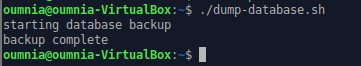
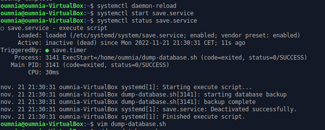

## Installation mysql
    
    sudo apt-get update  
    sudo apt install mysql-server
  

##	Création d'un utilisateur avec tous les privilèges
    
    sudo mysql -u root 
    # Connection à mysql 
    mysql> CREATE USER 'oumnia'@'localhost' IDENTIFIED BY 'mot_de_passe'
    mysql> GRANT ALL PRIVILEGES ON * . * TO 'oumnia'@'localhost';
    mysql> FLUSH PRIVILEGES;
    mysql>exit
    # l'utilisateur oumnia a maintenant tout les droits.
    

  ```
 mysql> alter user oumnia@localhost identified with auth_socket;

    #pour faire fonctionner mon service sinon on demande le mot
     de passe à chaque fois.
 ```
 
## Telechargement de la database

    wget https://www.mysqltutorial.org/wp-content/uploads/2018/03/mysqlsampledatabase.zip 

    mysql> source /home/oumnia/mysqlsampledatabase.sql
    # importation de la base de donnée

## Le script

```
vim dump-database.sh
#!/bin/bash
 exec &>>/var/log/dump-mysql.log
  #Transfert vers .log
 echo "starting database backup"
current_date=$(date +%F+%H+%M+%S)
mysqldump -u oumnia classicmodels|bzip2 -c  > "$current_date.sql.bz2"                                  
 echo "backup complete" 
 ```  
 ```   
fic=”*.bz2”                                                                                     
ls -t *fic | tail -n +5 | while read fic                                                                                     
do
    if test -e $fic
    then
     rm $fic
  fi
done
#si le nombre de fichier dépasse 5, on supprime les anciens
 ```
 
    Et pour l'executer 
    ./dump-database.sh



## Le service
```
sudo vim /etc/systemdsud/system/save.service

[Unit]
Description=execute script
After=network.target
[Service]
WorkingDirectory=/home/oumnia
User=oumnia
ExecStart=/home/oumnia/dump-database.sh                                                                       
Type=oneshot                                              
[Install]                                        
WantedBy=multi-user.target
Ln -s /lib/system/system/save.service /etc/systemd/system/multi-user.target.wants/
# optionnel : Créer le lien vers systemd 
 ```
```
# pour le lancer
Sudo systemctl daemon-reload
Sudo systemctl start save.service
Sudo systemctl status save.service
```
## Le timer
```
Sudo vi /etc/systemd/system/save.timer
[Unit]                                                                                              
Description=Run save every ten minutes
[Timer] 
OnCalendar=*-*-* *:00,10,20,30,40,50:00                              
[Install]
WantedBy=timers.target
# la sauvegarde se fait chaque 10 min
```
```
# Pour le lancer
Sudo systemctl daemon-reload
Sudo systemctl enable save.timer
Sudo systemctl start save.timer
```


## Sortie log
```
Proposition pour la gestion d'espace du fichier .log 
Sudo touch /var/log/dump-mysql.log
/var/log/dump-mysql.log {
Monthly
Rotate 12                                              
 #intervalle de rotation
Compress                                         
 #retarde process de compression jusqu’à la prochaine rotation
Delaycompress
Missingok                                            
 # le processus ne s’arrête pas à chaque erreur
Notifempty                                       
 # empêche de la rotation si fichier vide
Creat 644 root root                        
 # création d’un fichier après la rotation des logs
Size 100M
# l'espace alloué est de 100M
}

